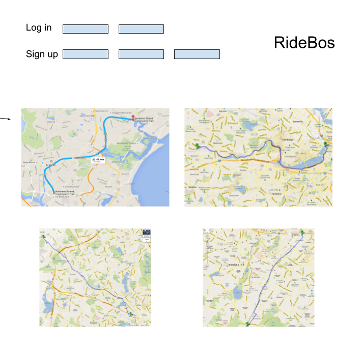
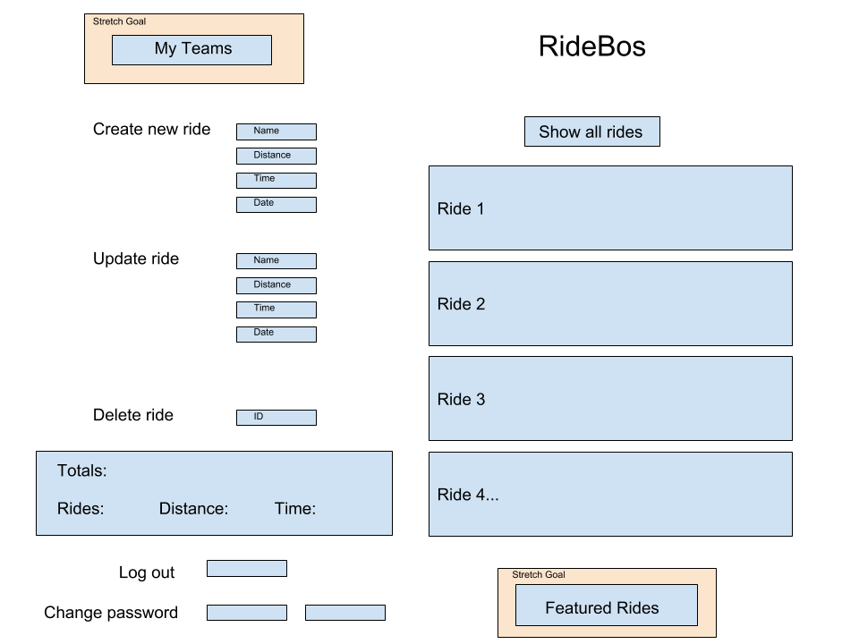
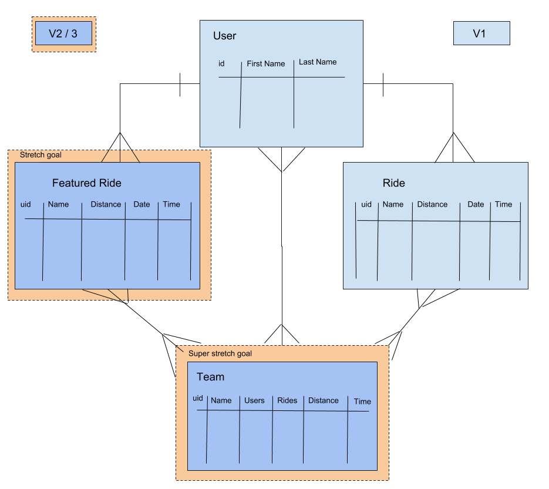

# RidBOS API

The RideBOS app is a bike ride tracker which will store details of bike rides along with your total miles ridden, ride time, and longest ride.

It is a JavaScript-based front-end which communicates with a Rails API.

## API End Points

| Verb   | URI Pattern            | Controller#Action |
|--------|------------------------|-------------------|
| POST   | `/sign-up`             | `users#signup`    |
| POST   | `/sign-in`             | `users#signin`    |
| DELETE | `/sign-out`            | `users#signout`   |
| PATCH  | `/change-password`     | `users#changepw`  |
| GET    | `/rides`               | `rides#index`     |
| POST   | `/rides`               | `rides#create`    |
| GET    | `/rides/:id`           | `rides#show`      |
| PATCH  | `/rides/:id`           | `rides#update`    |

## Technologies used:
#### Front-end:
+ JavaScript
+ jQuery
+ Bootstrap
+ SCSS

##### Deployed on:
+ Github pages

#### API:
+ Ruby on Rails
+ PostgreSQL

##### Deployed on:
+ Heroku

## Links to front-end and API:
Front-end:
https://dwbergstrom.github.io/ridebos-client/

API:
https://ridebosapi.herokuapp.com/

### Wireframes and entity relationship diagram:
Pre-login:
https://drive.google.com/open?id=1E_Gk2IzBW5LK_q_8YEMbk-InqXb7Rmqy

Post-login:
https://drive.google.com/open?id=1nkWqAFWGbJf54do4m2pU8WrAFa6irYrK

ERD:
https://drive.google.com/open?id=1qjttZQbaXPSGFn2KDuidpY83NMAmBsIV

## User Stories
#### As a user, I can:
##### For auth:
+ sign up
+ sign in
+ sign out
+ change password

##### For main functionality:
+ create a ride
+ update a ride (update distance, name, time, date)
+ delete a ride
+ show total rides
+ show total distance
+ show longest ride
+ show average speed

## Planning and Process
For this project, I started by planning the structure of the ride resource and its relationship to the user.  I also decided to make the ride resource controller inherit the ProtectedController class so that rides would only be visible to their owner.

I attempted to structure the planning in terms of goals for the project deadline first, then include some stretch goals for future iterations.

Development started on the Ruby backend on day one:  get the ride resource scaffolded and tested with cURL requrests.  Once tested, I implemented the skeleton of the front end, starting with auth, then CRUD events for rides.  After full functionality, I moved onto styling, and focused quite a bit on digging into Bootstrap's nice documentation to clean up the UI.

See below for the future roadmap!

## Planned Fixes / Improvements / Features
+ Implement better update/delete functionality (add a delete / update option within the individual ride, instead of requiring the ID to be typed)
+ Collapse all CRUD actions into slideToggle menus
+ Add user profile resource (one-to-one relationship with user)
+ Add Teams resource (many-to-many relationship with users)
+ Add Featured Rides resource (one-to-many relationship with user)
+ Add points system to Featured Rides for competitions / games
+ Implement 3rd party API for GPS data / mapping functionality
